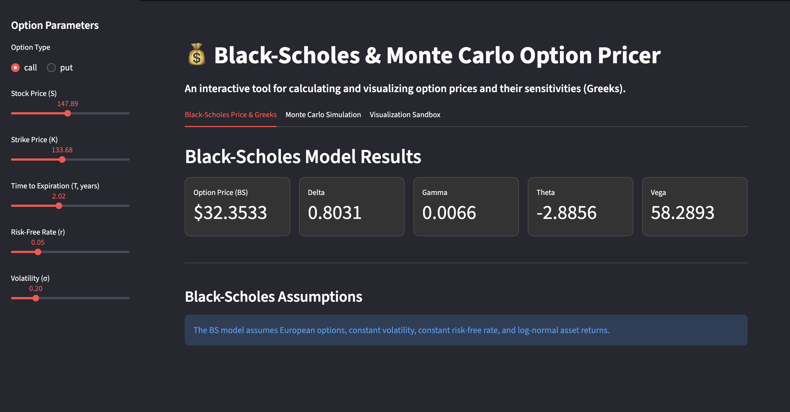
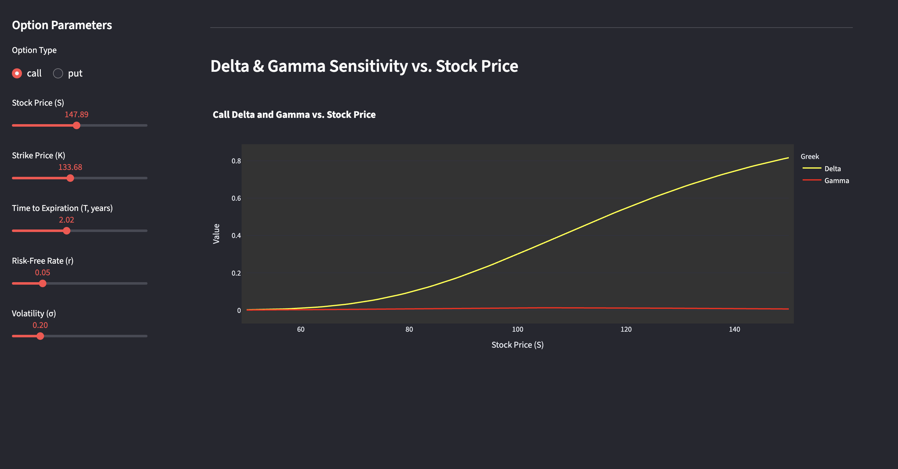

# 📈 Fintech Option Pricer (Black-Scholes & Monte Carlo)

**A high-performance financial engineering application for valuing European options and visualizing key sensitivities (Greeks). Built using Python and Streamlit.**

---

## 🎯 Project Highlights for Software Engineering

This project demonstrates core competencies essential for a Software Engineering role:

* **Front-End Development (Python):** Design and deployment of a modern, interactive web application using the **Streamlit** framework for rapid prototyping.
* **Complex Algorithm Implementation:** Clean, modular implementation of two sophisticated financial models: the **Black-Scholes formula** and the **Monte Carlo simulation**.
* **Advanced Visualization (Plotly):** Use of the **Plotly** library to create impressive, interactive charts, including **3D Option Price Surfaces** and **Greek Sensitivity Line Plots**.
* **Code Organization:** Modular structure separating the UI (`app.py`) from the core financial logic (`calculations/`).

---

## 🖼️ Application Gallery (Screenshots)

Since the application is not live, these screenshots showcase the clean UI design and the powerful, interactive Plotly visualizations.

| Page / Chart | Description | Screenshot |
| :--- | :--- | :--- |
| **Main Dashboard** | Sidebar inputs and metric cards showing the calculated Option Price and Greeks (Delta, Gamma, etc.). |  |
| **Monte Carlo Tab** | Interactive section for running the Monte Carlo simulation and viewing the price result. |  |
| **3D Price Surface** | Interactive Plotly surface plot demonstrating Option Price sensitivity across changes in Stock Price and Volatility. |  |
| **Sensitivity Lines** | Interactive Plotly line chart showing how Delta and Gamma (Greeks) change as the underlying stock price moves. |  |

---

## 💻 Tech Stack

| Category | Tools & Libraries | Purpose |
| :--- | :--- | :--- |
| **App Framework** | **Streamlit** | Rapidly built the interactive, data-driven web interface. |
| **Visualization** | **Plotly**, Matplotlib, Seaborn | Generating interactive 3D/2D option sensitivity charts. |
| **Core Calculations** | Python, NumPy, SciPy (`norm`) | High-speed, vectorized mathematical computation. |

---
## 📦 Getting Started (Local Run)

1.  **Clone the Repository**
    ```bash
    git clone https://github.com/desrocheskyle/Black-Scholes-Option-Pricer.git
    ```

2.  **Set Up Virtual Environment & Install Dependencies**
    ```bash
    # Create the virtual environment
    python3 -m venv .venv

    # Activate your virtual environment (for Linux/macOS)
    source .venv/bin/activate 

    # Install all required libraries
    pip install -r requirements.txt
    ```

3.  **Run the App**
    (Ensure your virtual environment is active, which is indicated by `(.venv)` in your terminal prompt)
    ```bash
    python -m streamlit run app.py
    ```
